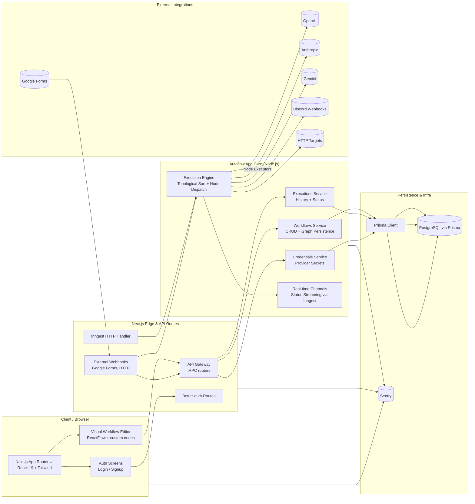

## Autoflow

**Autoflow** is a visual workflow automation platform that lets you design, observe, and replay complex cross-service workflows as if you were stepping through a time machine for your product operations. Teams use Autoflow to orchestrate multi-step flows across AI providers, webhooks, forms, and messaging platforms, get deterministic executions via Inngest, and inspect every run end-to-end from a single, unified graph.

Autoflow is built on **Next.js**, **Node.js**, **Inngest**, **tRPC**, and **Prisma**, with a ReactFlow-based editor for the visual layer.

---

### Architecture (high-level)



---

### Key capabilities

- **Visual workflow editor**: Drag-and-drop nodes (triggers, HTTP calls, AI model invocations, messaging) onto a canvas to build complex flows without writing orchestration code.
- **Deterministic executions with replay**: Workflows are executed via Inngest with full history, making it easy to replay, debug, and audit executions.
- **Multi-provider AI orchestration**: Built-in nodes for OpenAI, Anthropic, and Gemini, wired to user-scoped credentials with a consistent execution contract.
- **Trigger ecosystem**: Manual triggers, Google Form triggers, and webhooks that can fan into the same execution engine.
- **Typed API surface**: tRPC-based API with end-to-end TypeScript types between client and server.
- **Production-ready observability**: Sentry integrated across client, edge, and server paths for traces and errors.

---

### Getting started (development)

```bash
# install dependencies
bun install

# run dev server
bun run dev
```

Then open `http://localhost:3000` and:

- Create a workflow under **Workflows**
- Add triggers and execution nodes in the **Editor**
- Run the workflow and inspect executions under **Executions**

---

### Tech stack overview

- **Frontend / App Shell**: Next.js App Router, React 19, Tailwind CSS, ReactFlow
- **Backend / Orchestration**: Node.js, Inngest functions, tRPC, Prisma ORM, PostgreSQL
- **Auth**: better-auth (server + client), credential-based provider access
- **Observability**: Sentry (server, edge, client), structured error reporting
- **Tooling**: ESLint, Prettier, TypeScript, Bun/npm for scripts

